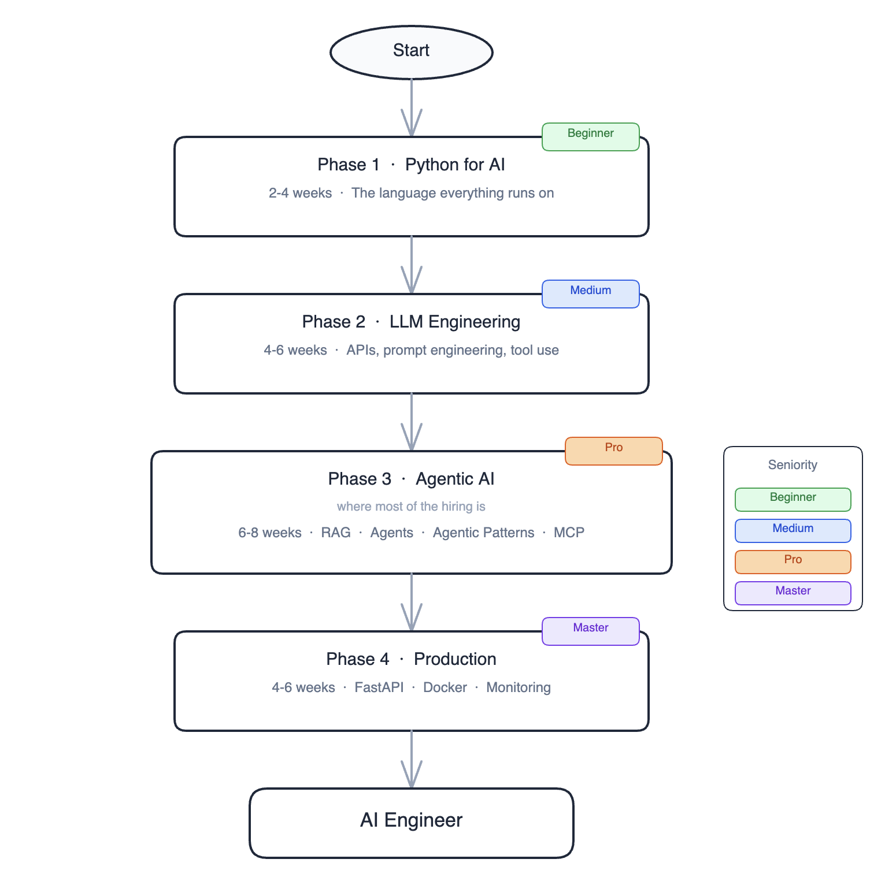

# AI Engineer from Scratch

The fastest path from developer to AI Engineer in 2026, built from real hiring data. Not theory, not hype.

Data sourced from active job postings across [LinkedIn](https://www.linkedin.com/jobs), [Indeed](https://www.indeed.com), [Glassdoor](https://www.glassdoor.com), [Wellfound](https://wellfound.com) and [Levels.fyi](https://www.levels.fyi/jobs) updated through 2025-2026.

> If this roadmap helps you, drop a ⭐ so others can find it.

This is not another "learn ML from scratch" guide. The market already moved. Companies are not hiring people to train models. They are hiring people who can build production systems on top of them: agents that reason and act, RAG pipelines that surface real knowledge, APIs that ship and scale. That is the actual job, and this roadmap is built around it.

It is free and community-driven. If you spot something outdated, find a better resource, or want to add a project, open a PR. Every contribution makes it more useful for everyone coming after you.

**Time:** 6-9 months at 10-15 hours per week  
**Cost:** 100% free resources  
**Target roles:** AI Engineer, LLM Engineer, Agentic AI Engineer

---

## What the market wants (2024-2026 job data)

| Skill | Signal |
|---|---|
| Python | 82% of all AI Engineer postings |
| LangChain / LangGraph | 39.9% of agentic AI roles |
| RAG systems | Dominant production use case across all company sizes |
| AI Agents | 980% job posting growth from 2024 to 2026 |
| FastAPI + Docker | 1,700+ active postings combining AI with these tools |
| MCP (Model Context Protocol) | Emerging standard already in job descriptions |

**What the market does not care about as much:**
- Math (linear algebra, calculus) shows up explicitly in fewer than 20% of AI Engineer postings
- Training models from scratch is an ML Engineer job, which is a different and narrower role
- Deep learning theory is useful background, but it is not a hiring requirement

This roadmap targets AI Engineer and LLM Engineer roles, where demand is growing fastest.

---

## The full map



---

## Generative AI: core concepts

These are the ideas that come up everywhere. You do not need to memorize them before starting. Read through once, then come back when something does not click.

**Large Language Model (LLM)**  
A neural network trained on massive amounts of text. It generates output by predicting the next token given everything that came before. GPT-4, Claude, Gemini, and Llama are all LLMs. The quality difference between models matters a lot in practice.

**Token**  
The unit LLMs read and write. Not words, chunks of characters. "unbelievable" might be three tokens. API pricing, context limits, and speed all work in tokens. A rough rule: one token is about 0.75 words.

**Context window**  
The maximum tokens an LLM can process in one call, input plus output combined. GPT-4o handles 128k. Claude goes up to 200k. When your data does not fit, you need RAG.

**Prompt**  
The input you send to a model. Everything you engineer about it, the structure, the examples, the instructions, is prompt engineering.

**Embedding**  
A list of numbers representing the meaning of a piece of text. Similar texts have similar vectors. You use embeddings to search for relevant content by meaning rather than by keywords. It is the foundation of every RAG system.

**RAG (Retrieval-Augmented Generation)**  
Instead of asking the model to recall facts it may or may not have learned during training, you retrieve the relevant information yourself and put it in the prompt. This is how you build LLM applications on your own data without fine-tuning anything.

**Agent**  
An LLM that can take actions: call tools, run code, search the web, write files, and loop until a goal is met. Not a single LLM call, but a reasoning loop.

**Tool / Function calling**  
Letting the model invoke your functions. The model decides when to call them and with what arguments. This is how agents interact with the real world.

**MCP (Model Context Protocol)**  
An open standard for connecting LLMs to tools and data sources. Instead of writing custom integration code for every tool, MCP defines a universal protocol. One server, any client.

**A2A (Agent-to-Agent Protocol)**  
Google's open protocol for agent interoperability. Where MCP connects agents to tools and data, A2A lets agents talk to other agents regardless of the framework they were built with. An agent built with LangGraph can delegate work to one built with CrewAI or Google ADK. It standardizes how agents discover each other, exchange tasks, and stream results back.

**Skills (Anthropic)**  
Anthropic's pattern for structuring reusable agent capabilities. Instead of giving an agent one big list of tools, you group related tools into a named skill with its own context and instructions. The agent loads the skills it needs for a given task. It keeps agents focused and makes complex behavior composable without making the system prompt unmanageable.

**Context engineering**  
The discipline of managing what goes into the LLM's context window on every call. Context determines quality, cost, and latency. You decide what to include, what to compress, what to cache, and what to leave out. Prompt caching, rolling summaries, and dynamic retrieval are all context engineering tools.

**Memory (agent)**  
The mechanisms that let an agent remember things beyond a single API call. In-context memory is the message list. Semantic memory is a vector store of persistent facts. Episodic memory is a log of past agent runs. External memory is a database that survives between sessions. Production agents combine several of these.

**Fine-tuning**  
Training a pre-trained model further on your own data to change its behavior. It is expensive, slow to update, and rarely the right first choice. Prompt engineering and RAG solve most problems without it.

**Vector database**  
A database built for storing and searching embeddings. You store document vectors, query with a vector, and get back the closest matches. Common options: Chroma, Pinecone, pgvector, Qdrant.

**Inference**  
Running a model to generate output, as opposed to training it. When you call the OpenAI API, you are doing inference.

---

## Glossary

| Term | What it means |
|---|---|
| **Prompt** | The text input you send to a model |
| **Completion** | The model's output |
| **System prompt** | Instructions that set the model's behavior for the whole conversation |
| **Temperature** | Controls randomness. 0 = deterministic. 1+ = more creative |
| **Top-p / nucleus sampling** | Alternative to temperature; controls diversity of outputs |
| **Hallucination** | When the model confidently generates something false |
| **Grounding** | Connecting model output to real data to reduce hallucination |
| **Context stuffing** | Putting all relevant info in the prompt instead of relying on model memory |
| **Chunking** | Splitting documents into smaller pieces before embedding them for RAG |
| **Reranking** | After retrieval, scoring chunks again to pick the most relevant ones |
| **Chain** | A sequence of LLM calls where the output of one feeds the input of the next |
| **ReAct** | Reason + Act: the pattern where a model reasons about what to do, then does it |
| **Agentic loop** | The cycle: think, act, observe result, think again |
| **Orchestrator** | Code or a model that coordinates other agents or tools |
| **HuggingFace** | Platform hosting thousands of open-source models you can run locally or via API |
| **Ollama** | Tool for running open-source LLMs locally on your machine, no API key needed |
| **LangChain** | Library for building LLM applications; components for chains, agents, retrieval |
| **LangGraph** | Extension of LangChain for building stateful agents as graphs |
| **Langfuse** | Open-source LLM observability: trace every call, measure cost and quality |
| **RAGAS** | Framework for evaluating RAG pipelines on faithfulness, relevance, recall |
| **Pydantic** | Python library for data validation and typed models; used for structured LLM output |
| **Structured output** | Getting the model to return valid JSON matching a schema you define |
| **Prompt caching** | Reusing computed context across calls to save cost and latency (Anthropic feature) |
| **Context engineering** | The discipline of deciding what goes into the context window on every call: what to include, compress, cache, or exclude to maximize quality and minimize cost |
| **Token budget** | The planned allocation of tokens across system prompt, history, retrieved docs, and response within a fixed context window |
| **Context compression** | Techniques for reducing conversation history size without losing critical information — rolling summaries, selective retention, embedding-based filtering |
| **Semantic memory** | Long-term persistent facts and preferences stored as embeddings in a vector database, retrieved by similarity when relevant |
| **Episodic memory** | Logs of past agent runs: what was attempted, what worked, what failed — used to avoid repeating mistakes |
| **In-context memory** | The current conversation message list; the simplest form of agent memory, lost when the session ends |
| **Working memory** | A compressed summary of recent conversation history, used when the full history does not fit in the context window |
| **Mem0** | Open-source memory layer that handles storage, retrieval, and updating of agent memories across users and sessions |
| **Zep** | Memory layer for LLM apps with automatic summarization and entity extraction from conversation history |
| **Tokenizer** | The component that converts text to tokens and back |
| **tiktoken** | OpenAI's tokenizer library; lets you count tokens before sending a request |
| **SSE (Server-Sent Events)** | How streaming LLM responses work over HTTP |

---

## Who is this for

| Profile | Where to start |
|---|---|
| Complete beginner | Phase 1, work through it fully |
| Developer switching to AI | Phase 2, you have the Python already |
| Already calling LLM APIs | Phase 3, agentic patterns are where the gap usually is |
| Building agents but not shipping them | Phase 4 |

---

## Repository structure

```
ai-engineer-from-scratch/
├── README.md
├── roadmap.excalidraw
│
├── phase-1-python-for-ai/          <- foundation, 2-4 weeks
│   └── README.md
│
├── phase-2-llm-engineering/        <- APIs, prompts, tool use
│   ├── README.md
│   ├── 01-how-llms-work/
│   ├── 02-api-and-tool-use/
│   ├── 03-prompt-engineering/
│   └── 04-context-engineering/
│
├── phase-3-agentic-ai/             <- where the jobs are
│   ├── README.md
│   ├── 01-rag-systems/
│   ├── 02-agentic-patterns/
│   ├── 03-langgraph/
│   ├── 04-multi-agent/
│   ├── 05-mcp/
│   └── 06-memory-systems/
│
├── phase-4-production/
│   ├── README.md
│   ├── 01-fastapi/
│   ├── 02-docker-and-deployment/
│   └── 03-monitoring/
│
└── final-project/
    └── README.md
```

---

## Phase 1 - Python for AI

Folder: [`phase-1-python-for-ai/`](./phase-1-python-for-ai/)

**Duration:** 2-4 weeks  
**Goal:** write async, typed Python and call HTTP APIs confidently.

| Topic | Free resource | Time |
|---|---|---|
| Async/await | [Real Python - Async IO](https://realpython.com/async-io-python/) | 1 week |
| OOP and type hints | [Python Docs - typing](https://docs.python.org/3/library/typing.html) | 3 days |
| HTTP APIs with httpx | [HTTPX Docs](https://www.python-httpx.org/) | 2 days |
| JSON, environment variables, .env files | [python-dotenv](https://pypi.org/project/python-dotenv/) | 1 day |
| Pandas basics for data handling | [Kaggle Learn - Pandas](https://www.kaggle.com/learn/pandas) | 3 days |

Skip this phase if you already write async Python at work.

---

## Phase 2 - LLM Engineering

Folder: [`phase-2-llm-engineering/`](./phase-2-llm-engineering/)

**Duration:** 4-6 weeks  
**Goal:** call any LLM API, use tool/function calling, write prompts that work, run models locally.

| Topic | Free resource | Time |
|---|---|---|
| How LLMs work (conceptual) | [The Illustrated Transformer](https://jalammar.github.io/illustrated-transformer/) | 2 days |
| HuggingFace for inference | [HuggingFace Course Ch. 1-3](https://huggingface.co/learn/nlp-course/chapter1/1) | 1 week |
| OpenAI API + function calling | [OpenAI Cookbook](https://cookbook.openai.com/) | 1 week |
| Anthropic Claude API + tool use | [Anthropic Docs](https://docs.anthropic.com/) | 3 days |
| Local models with Ollama | [Ollama docs](https://ollama.com/docs) | 2 days |
| Prompt engineering | [Anthropic Prompt Engineering Guide](https://docs.anthropic.com/en/docs/build-with-claude/prompt-engineering/overview) | 1 week |
| Context engineering + prompt caching | [Anthropic Prompt Caching Docs](https://docs.anthropic.com/en/docs/build-with-claude/prompt-caching) | 1 week |

---

## Phase 3 - Agentic AI

Folder: [`phase-3-agentic-ai/`](./phase-3-agentic-ai/)

**Duration:** 6-8 weeks  
**This is the core of the roadmap.** RAG and agents are what most companies are building. LangGraph appears in 39.9% of agentic job postings. MCP is the emerging standard for tool connectivity.

### RAG Systems
| Topic | Free resource | Time |
|---|---|---|
| Embeddings and vector databases | [Pinecone Learning Center](https://www.pinecone.io/learn/) | 1 week |
| RAG pipeline from scratch | [LlamaIndex Docs](https://docs.llamaindex.ai/) | 1 week |
| Advanced RAG (reranking, HyDE) | [LlamaIndex Advanced RAG](https://docs.llamaindex.ai/en/stable/optimizing/advanced_retrieval/) | 1 week |
| Evaluating RAG with RAGAS | [RAGAS Docs](https://docs.ragas.io/) | 3 days |

### Agentic Patterns
| Topic | Free resource | Time |
|---|---|---|
| ReAct pattern | [Original ReAct paper](https://arxiv.org/abs/2210.03629) | 2 days |
| Planning and reflection patterns | [LangGraph Docs](https://langchain-ai.github.io/langgraph/) | 1 week |
| LangGraph - stateful agents | [LangGraph Tutorials](https://langchain-ai.github.io/langgraph/tutorials/) | 2 weeks |
| Multi-agent systems with CrewAI | [CrewAI Docs](https://docs.crewai.com/) | 1 week |
| MCP - Model Context Protocol | [MCP Docs](https://modelcontextprotocol.io/) | 1 week |
| A2A - Agent-to-Agent Protocol | [Google A2A Docs](https://google.github.io/A2A/) | 3 days |
| Skills pattern - Anthropic | [Anthropic Agent Docs](https://docs.anthropic.com/en/docs/agents-and-tools/claude-code/agent-skills) | 3 days |
| Memory systems (Mem0, Zep, LangGraph) | [LangGraph Memory Docs](https://langchain-ai.github.io/langgraph/concepts/memory/) | 1 week |

---

## Phase 4 - Production

Folder: [`phase-4-production/`](./phase-4-production/)

**Duration:** 4-6 weeks  
FastAPI + Docker is in 1,700+ active AI engineer job postings. You can build great agents and still be unemployable if you cannot ship them.

| Topic | Free resource | Time |
|---|---|---|
| FastAPI for AI APIs | [FastAPI Docs](https://fastapi.tiangolo.com/) | 1 week |
| Docker and Docker Compose | [Play with Docker](https://labs.play-with-docker.com/) | 1 week |
| Deployment to cloud (AWS/GCP) | [AWS Free Tier](https://aws.amazon.com/free/) | 1 week |
| Experiment tracking with MLflow | [MLflow Docs](https://mlflow.org/docs/latest/index.html) | 3 days |
| LLM monitoring with Langfuse | [Langfuse Docs](https://langfuse.com/docs) | 3 days |
| Guardrails and eval pipelines | [RAGAS](https://docs.ragas.io/) + [DeepEval](https://docs.confident-ai.com/) | 1 week |

---

## Final Project

Folder: [`final-project/`](./final-project/)

A **multi-agent research assistant** with RAG, deployed as a FastAPI service with Langfuse monitoring. Every piece of the roadmap in one real system.

---

## Essential resources

| Resource | Why |
|---|---|
| [ai.Engineer on YouTube](https://www.youtube.com/@aiDotEngineer) | Walkthroughs and project breakdowns for everything in this roadmap |
| [fast.ai](https://fast.ai) | Best practical deep learning course if you want ML depth |
| [DeepLearning.AI short courses](https://www.deeplearning.ai/courses/) | RAG, agents, LLMs by Andrew Ng, all free |
| [HuggingFace Learn](https://huggingface.co/learn) | Transformers, pipelines, hands-on |
| [Andrej Karpathy YouTube](https://www.youtube.com/@AndrejKarpathy) | How LLMs actually work under the hood |
| [LangChain blog](https://blog.langchain.dev/) | Agentic patterns as they emerge |
| [The Batch](https://www.deeplearning.ai/the-batch/) | Weekly AI news |

---

## Contributing

Found a better resource, a broken link, or a missing topic? Contributions are welcome.

1. Clone the repo and create a branch: `git checkout -b add/your-topic`
2. Make your changes
3. Open a Pull Request with a short description of what you added and why


---

MIT License
